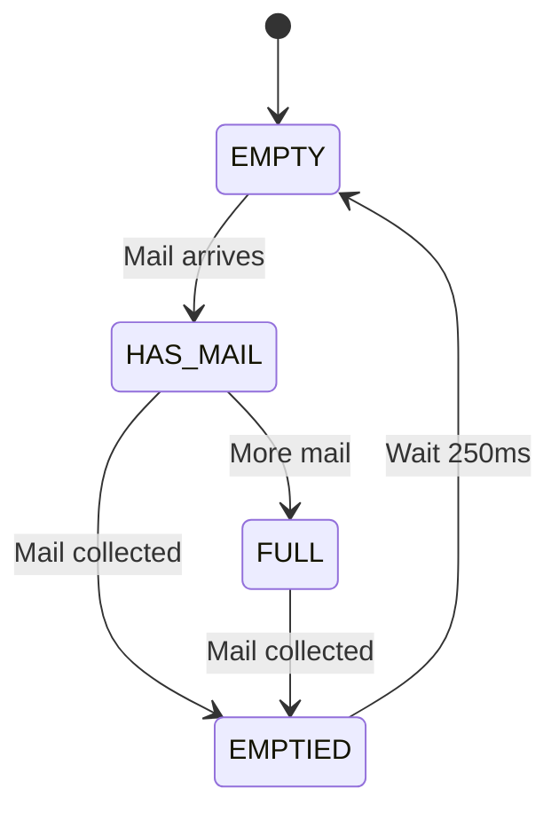

# IoT Mailbox Monitor

An ESP32-based smart mailbox system that detects mail delivery and collection using an HC-SR04 ultrasonic distance sensor with state machine tracking.

## Overview

The system monitors the distance from the top of a mailbox to the floor. When mail is delivered, the distance decreases, triggering a detection event. A state machine tracks mailbox status (empty, has mail, full, emptied) to prevent false duplicate events. Multiple layers of filtering and validation prevent false positives from insects, vibrations, or sensor noise.

## How It Works

1. **Ultrasonic sensor** measures distance to mailbox floor every second
2. **Median filter** smooths readings and removes outliers
3. **State machine** tracks mailbox status to prevent duplicate events
4. **Detection algorithm** identifies persistent distance changes (mail delivery/collection)
5. **Telemetry system** logs events and periodic status updates

## Hardware Requirements

- ESP32 development board
- HC-SR04 ultrasonic distance sensor
- LED (onboard or external)
- Power supply (USB or battery)

## Project Structure

```
├── config/
│   └── config.hpp                    # Global configuration constants
│
├── hardware/
│   ├── led/
│   │   ├── led.hpp                   # LED control interface
│   │   └── led.cpp                   # LED implementation
│   │
│   └── ultrasonic/
│       ├── hcsr04.hpp                # HC-SR04 sensor interface
│       └── hcsr04.cpp                # HC-SR04 sensor implementation
│
├── processor/
│   └── distance/
│       ├── distance_processor.hpp    # Distance processing & detection
│       └── distance_processor.cpp    # Filtering, tracking, state machine
│
├── telemetry/
│   └── distance/
│       ├── distance_telemetry.hpp    # Telemetry publishing interface
│       └── distance_telemetry.cpp    # JSON formatting & logging
│
└── main.cpp                          # Application entry point & LED control
```

## Architecture

The system follows a simple three-layer pipeline with state management:

```
HCSR04 Sensor → Distance Processor → Telemetry Publisher
    (raw)       (filtered + state)       (formatted)
```

### Layer Responsibilities

| Layer                 | Purpose                                               | Outputs                                       |
| --------------------- | ----------------------------------------------------- | --------------------------------------------- |
| **HCSR04**            | Raw distance measurement                              | Distance in cm (or -1 on timeout)             |
| **DistanceProcessor** | Filtering, state tracking, detection, quality metrics | Structured `DistanceData` with state & events |
| **DistanceTelemetry** | JSON formatting and publishing                        | Event logs and periodic status updates        |

### Mailbox States

The processor maintains one of four states:

| State        | Description                      | Can Trigger            |
| ------------ | -------------------------------- | ---------------------- |
| **EMPTY**    | Mailbox is empty, ready for mail | `mail_drop` event      |
| **HAS_MAIL** | Mail detected and present        | `mail_collected` event |
| **FULL**     | Mailbox is full (multiple items) | `mail_collected` event |
| **EMPTIED**  | Just emptied (transitional)      | (none - brief state)   |

### Data Flow

```cpp
// main.cpp - Simple and clear
while (true) {
    // 1. Measure
    float raw = ultrasonic.MeasureDistance();

    // 2. Process (filter, detect, track state)
    DistanceData data = processor.Process(raw);

    // 3. Visual feedback based on state
    if (data.mail_detected)
        led.Blink(10, 100);  // Celebration!
    else if (data.mail_collected)
        led.Blink(5, 200);   // Acknowledgment
    else
        // State-based indicators
        switch (data.state) {
            case EMPTY:    led.Off(); break;
            case HAS_MAIL: led.Blink(1, 500); break;
            case FULL:     led.On(); break;
            case EMPTIED:  led.Blink(3, 150); break;
        }

    // 4. Publish telemetry
    telemetry.Publish(data, processor.GetBaseline(), processor.GetThreshold());

    // 5. Wait for next cycle
    vTaskDelay(pdMS_TO_TICKS(1000));
}
```

## Configuration

All system parameters are defined in `config/config.hpp`:

### Key Parameters

```cpp
// Hardware pins
HCSR04_TRIGGER_PIN = GPIO_NUM_2
HCSR04_ECHO_PIN = GPIO_NUM_3
LED_PIN = GPIO_NUM_8

// Detection sensitivity
BASELINE_CM = 40.0          // Empty mailbox distance (CALIBRATE THIS!)
TRIGGER_DELTA_CM = 3.0      // Minimum change to detect (cm)
HOLD_MS = 250               // Must persist this long (ms)
REFRACTORY_MS = 8000        // Cooldown between events (ms)

// Signal processing
FILTER_WINDOW = 5           // Median filter size (samples)
DISTANCE_MEASUREMENT_INTERVAL_MS = 1000  // Measurement frequency

// Telemetry
TELEMETRY_PERIOD_MS = 10000 // Status update interval (10 seconds)
```

### Derived Thresholds

The processor automatically calculates three thresholds from `BASELINE_CM` and `TRIGGER_DELTA_CM`:

```cpp
Empty threshold  = BASELINE_CM - (TRIGGER_DELTA_CM × 0.5)  // 38.5 cm
Trigger threshold = BASELINE_CM - TRIGGER_DELTA_CM          // 37.0 cm
Full threshold    = BASELINE_CM - (TRIGGER_DELTA_CM × 2)    // 34.0 cm
```

### Calibration

1. **Measure your mailbox**: Place sensor at top, measure distance to empty floor
2. **Set `BASELINE_CM`**: Update in `config.hpp` with your measurement
3. **Adjust sensitivity**: Tune `TRIGGER_DELTA_CM` based on typical mail thickness
4. **Test**: Monitor logs and adjust `HOLD_MS` if getting false positives

## Telemetry Output

### Periodic Status (every 10 seconds)

```json
{
  "telemetry": true,
  "distance_cm": 37.2,
  "filtered_cm": 37.3,
  "baseline_cm": 40.0,
  "threshold_cm": 37.0,
  "success_rate": 0.98,
  "mailbox_state": "has_mail"
}
```

**Mailbox states**: `"empty"`, `"has_mail"`, `"full"`, `"emptied"`

### Mail Drop Event (when new mail detected)

```json
{
  "event": "mail_drop",
  "baseline_cm": 40.0,
  "before_cm": 40.0,
  "after_cm": 37.2,
  "delta_cm": 2.8,
  "duration_ms": 485,
  "confidence": 0.87,
  "success_rate": 0.98,
  "new_state": "has_mail"
}
```

**Triggered**: Only when transitioning from EMPTY → HAS_MAIL

**Note**: This event will NOT fire repeatedly if mail sits in the box - the state machine prevents duplicate events.

### Mail Collection Event (when mailbox emptied)

```json
{
  "event": "mail_collected",
  "baseline_cm": 40.0,
  "before_cm": 37.2,
  "after_cm": 39.8,
  "delta_cm": 2.6,
  "duration_ms": 280,
  "success_rate": 0.97,
  "new_state": "emptied"
}
```

**Triggered**: When transitioning from HAS_MAIL or FULL → EMPTIED

## LED Indicators

The onboard LED provides visual feedback of system status:

| Pattern                 | Meaning                             | State      |
| ----------------------- | ----------------------------------- | ---------- |
| 10 fast blinks (100ms)  | New mail detected!                  | Event      |
| 5 medium blinks (200ms) | Mail collected                      | Event      |
| Off                     | Mailbox empty, all good             | EMPTY      |
| 1 slow blink (500ms)    | Mail present in mailbox             | HAS_MAIL   |
| Solid on                | Mailbox full                        | FULL       |
| 3 fast blinks (150ms)   | Just emptied (transitional)         | EMPTIED    |
| 2 blinks (300ms)        | Refractory period (cooldown)        | Post-event |
| 1 long blink (1000ms)   | Sensor success rate < 80% (warning) | Any state  |

## State Machine Behavior



**Key insight**: Once mail is detected, the system enters HAS_MAIL or FULL state and will NOT trigger another `mail_drop` event until the mailbox is emptied. This prevents false duplicate events from mail sitting in the box.

## Example Event Sequence

```
Time    Distance  State      Event           Notes
─────────────────────────────────────────────────────────────
0s      40.0 cm   EMPTY      -               Waiting for mail
1s      37.2 cm   EMPTY      -               Occlusion detected
1.3s    37.1 cm   HAS_MAIL   mail_drop       Held 250ms, confirmed!
2s      37.3 cm   HAS_MAIL   -               Mail sitting (no event)
3s      37.2 cm   HAS_MAIL   -               Still present (no event)
...     ...       HAS_MAIL   -               No duplicate events!
60s     37.1 cm   HAS_MAIL   -               Still present
61s     39.8 cm   HAS_MAIL   -               Rising...
61.3s   40.0 cm   EMPTIED    mail_collected  Returned to baseline!
61.5s   40.1 cm   EMPTY      -               Ready for new mail
```
