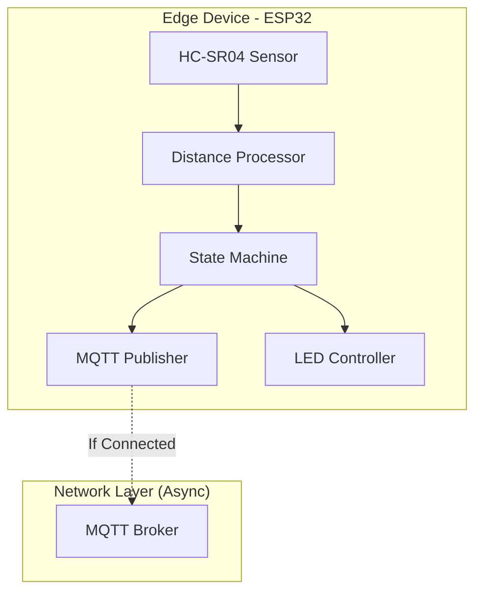
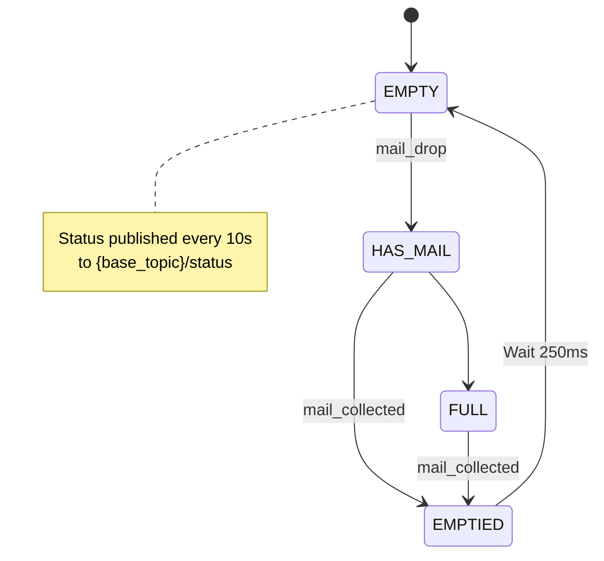

# IoT Mailbox Monitor

An ESP32-based smart mailbox system that detects mail delivery and collection using an HC-SR04 ultrasonic distance sensor. It features a robust, non-blocking architecture that ensures the sensor continues to operate and provide visual feedback even if Wi-Fi is unavailable.


## Overview

The system monitors the distance from the top of a mailbox to the floor. When mail is delivered, the distance decreases, triggering a detection event. A state machine tracks mailbox status (empty, has mail, full, emptied) to prevent false duplicate events.

**Key Features:**

- **Non-blocking Startup:** The sensor begins measuring immediately; it does not wait for Wi-Fi to connect.
- **Fault Tolerance:** If Wi-Fi drops, the system caches the current state and continues to operate locally (LED indicators remain functional).
- **Auto-Reconnection:** Background tasks handle Wi-Fi and MQTT reconnection automatically.
- **Smart Filtering:** Uses median filtering and refractory periods to ignore noise (insects, vibrations).

## How It Works

1.  **Initialization:** System initializes NVS (for Wi-Fi storage) and starts the network stack in the background.
2.  **Measurement:** Ultrasonic sensor measures distance every second (configurable).
3.  **Processing:**
    - **Median filter** smooths readings.
    - **State machine** determines if the change is a valid mail drop or collection event.
4.  **Feedback:** LED patterns indicate the current state (Empty, Has Mail, Full).
5.  **Telemetry:** If connected, JSON events and status updates are published via MQTT.

## Hardware Requirements

- ESP32 development board
- HC-SR04 ultrasonic distance sensor
- LED (onboard or external)

## IoT Value Stack



### Layer Responsibilities

| Layer                 | Purpose                                               | Outputs                                       |
| --------------------- | ----------------------------------------------------- | --------------------------------------------- |
| **HCSR04**            | Raw distance measurement                              | Distance in cm (or -1 on timeout)             |
| **DistanceProcessor** | Filtering, state tracking, detection, quality metrics | Structured `DistanceData` with state & events |
| **DistanceTelemetry** | JSON formatting and MQTT publishing                   | Event logs and periodic status updates        |
| **MQTTPublisher**     | Network communication                                 | Publishes JSON to MQTT broker topics          |

### Mailbox States

The processor maintains one of four states:

| State        | Description                      | Can Trigger            |
| ------------ | -------------------------------- | ---------------------- |
| **EMPTY**    | Mailbox is empty, ready for mail | `mail_drop` event      |
| **HAS_MAIL** | Mail detected and present        | `mail_collected` event |
| **FULL**     | Mailbox is full (multiple items) | `mail_collected` event |
| **EMPTIED**  | Just emptied (transitional)      | (none - brief state)   |

## Project Structure

```
├── config/
│ └── config.hpp # Global configuration constants
│
├── hardware/
│ ├── led/
│ │ ├── led.hpp # LED control interface
│ │ └── led.cpp # LED implementation
│ │
│ └── ultrasonic/
│ ├── hcsr04.hpp # HC-SR04 sensor interface
│ └── hcsr04.cpp # HC-SR04 sensor implementation
│
├── processor/
│ └── distance/
│ ├── distance_processor.hpp # Distance processing & detection
│ └── distance_processor.cpp # Filtering, tracking, state machine
│
├── telemetry/
│ ├── distance/
│ │ ├── distance_telemetry.hpp # Telemetry publishing interface
│ │ └── distance_telemetry.cpp # JSON formatting & logging
│ │
│ └── publisher/
│ ├── mqtt.hpp # MQTT client wrapper
│ └── mqtt.cpp # MQTT connection & publishing
│
└── main.cpp # Application entry point & LED control
```

## Software Architecture

The system follows a "Sensor First" priority. Network operations are decoupled from the measurement loop.

```cpp
// Pseudo-code logic of main.cpp
void app_main() {
    // 1. Init NVS (Required for Wi-Fi PHY)
    nvs_flash_init();

    // 2. Start Network (Async/Non-blocking)
    wifi_init();
    mqtt_init();

    // 3. Measurement Loop (Runs immediately)
    while (true) {
        float dist = sensor.measure();
        State state = processor.update(dist);

        led.update(state); // Visual feedback always works

        if (mqtt.isConnected()) {
            mqtt.publish(state);
        }

        delay(1000);
    }
}
```

## Configuration

All system parameters are defined in `config/config.hpp`:

### Key Parameters

```cpp
// Hardware pins
HCSR04_TRIGGER_PIN = GPIO_NUM_2
HCSR04_ECHO_PIN = GPIO_NUM_3
LED_PIN = GPIO_NUM_8

// Detection sensitivity
BASELINE_CM = 40.0          // Empty mailbox distance (CALIBRATE THIS!)
TRIGGER_DELTA_CM = 3.0      // Minimum change to detect (cm)
HOLD_MS = 250               // Must persist this long (ms)
REFRACTORY_MS = 8000        // Cooldown between events (ms)

// Signal processing
FILTER_WINDOW = 5           // Median filter size (samples)
DISTANCE_MEASUREMENT_INTERVAL_MS = 1000  // Measurement frequency

// Telemetry
TELEMETRY_PERIOD_MS = 10000 // Status update interval (10 seconds)

// MQTT Configuration
MQTT_BROKER_URI = "mqtt://192.168.1.100:1883"  // Your MQTT broker
MQTT_BASE_TOPIC = "home/mailbox"               // Base topic prefix
MQTT_CLIENT_ID = "mailbox-sensor-001"          // Unique client ID

// WIFI Connection
CONN_SSID = "Test"; // Wifi Connection SSID
PASSWORD = "Test";  // Wifi Connection Password
```

### Derived Thresholds

The processor automatically calculates three thresholds from `BASELINE_CM` and `TRIGGER_DELTA_CM`:

```cpp
Empty threshold  = BASELINE_CM - (TRIGGER_DELTA_CM × 0.5)  // 38.5 cm
Trigger threshold = BASELINE_CM - TRIGGER_DELTA_CM          // 37.0 cm
Full threshold    = BASELINE_CM - (TRIGGER_DELTA_CM × 2)    // 34.0 cm
```

### Calibration

1. **Measure your mailbox**: Place sensor at top, measure distance to empty floor
2. **Set `BASELINE_CM`**: Update in `config.hpp` with your measurement
3. **Adjust sensitivity**: Tune `TRIGGER_DELTA_CM` based on typical mail thickness
4. **Configure MQTT**: Set broker URI and topics in `config.hpp`
5. **Test**: Monitor logs and adjust `HOLD_MS` if getting false positives

## MQTT Integration

### Topic Structure

The system publishes to three topic patterns under your configured base topic:

```
{base_topic}/events/mail_drop      - New mail detected events
{base_topic}/events/mail_collected - Mail collection events
{base_topic}/status                - Periodic status updates
```

**Example with base topic `home/mailbox`:**

- `home/mailbox/events/mail_drop`
- `home/mailbox/events/mail_collected`
- `home/mailbox/status`

### Setup

```cpp
// In main.cpp initialization
Telemetry::Distance::DistanceTelemetry telemetry;

// Initialize MQTT with your broker settings
esp_err_t err = telemetry.initMQTT(
    MQTT_BROKER_URI,      // Broker URI (or mqtts:// for TLS)
    MQTT_BASE_TOPIC,      // Base topic
    MQTT_CLIENT_ID,       // Client ID
    nullptr,              // Username (optional)
    nullptr               // Password (optional)
);

if (err == ESP_OK) {
    ESP_LOGI("MAIN", "MQTT initialized successfully");
}
```

### Connection Features

- **Auto-reconnect**: Automatically reconnects if connection is lost
- **Keepalive**: 60-second ping to maintain connection
- **QoS 1**: At-least-once delivery guarantee for all messages
- **Connection status**: Check with `isConnected()` before critical operations

## Telemetry Output

### Periodic Status (every 10 seconds)

**Topic**: `{base_topic}/status`

```json
{
  "telemetry": true,
  "distance_cm": 37.2,
  "filtered_cm": 37.3,
  "baseline_cm": 40.0,
  "threshold_cm": 37.0,
  "success_rate": 0.98,
  "mailbox_state": "has_mail"
}
```

**Mailbox states**: `"empty"`, `"has_mail"`, `"full"`, `"emptied"`

### Mail Drop Event (when new mail detected)

**Topic**: `{base_topic}/events/mail_drop`

```json
{
  "event": "mail_drop",
  "baseline_cm": 40.0,
  "before_cm": 40.0,
  "after_cm": 37.2,
  "delta_cm": 2.8,
  "duration_ms": 485,
  "confidence": 0.87,
  "success_rate": 0.98,
  "new_state": "has_mail"
}
```

**Triggered**: Only when transitioning from EMPTY → HAS_MAIL

**Note**: This event will NOT fire repeatedly if mail sits in the box - the state machine prevents duplicate events.

### Mail Collection Event (when mailbox emptied)

**Topic**: `{base_topic}/events/mail_collected`

```json
{
  "event": "mail_collected",
  "baseline_cm": 40.0,
  "before_cm": 37.2,
  "after_cm": 39.8,
  "delta_cm": 2.6,
  "duration_ms": 280,
  "success_rate": 0.97,
  "new_state": "emptied"
}
```

**Triggered**: When transitioning from HAS_MAIL or FULL → EMPTIED

## LED Indicators

The onboard LED provides visual feedback of system status:

| Pattern                 | Meaning                             | State      |
| ----------------------- | ----------------------------------- | ---------- |
| 10 fast blinks (100ms)  | New mail detected!                  | Event      |
| 5 medium blinks (200ms) | Mail collected                      | Event      |
| Off                     | Mailbox empty, all good             | EMPTY      |
| 1 slow blink (500ms)    | Mail present in mailbox             | HAS_MAIL   |
| Solid on                | Mailbox full                        | FULL       |
| 3 fast blinks (150ms)   | Just emptied (transitional)         | EMPTIED    |
| 2 blinks (300ms)        | Refractory period (cooldown)        | Post-event |
| 1 long blink (1000ms)   | Sensor success rate < 80% (warning) | Any state  |
| 1 Short Blip (50ms)     | Sensor OK; No Wi-Fi (warning)       | Any state  |

## State Machine Behavior



**Key insight**: Once mail is detected, the system enters HAS_MAIL or FULL state and will NOT trigger another `mail_drop` event until the mailbox is emptied. This prevents false duplicate events from mail sitting in the box.

## Example Event Sequence

```
Time    Distance  State      Event           MQTT Topic
──────────────────────────────────────────────────────────────────────────────
0s      40.0 cm   EMPTY      -               {base}/status (periodic)
1s      37.2 cm   EMPTY      -               Occlusion detected
1.3s    37.1 cm   HAS_MAIL   mail_drop       {base}/events/mail_drop
2s      37.3 cm   HAS_MAIL   -               Mail sitting (no event)
3s      37.2 cm   HAS_MAIL   -               Still present (no event)
...     ...       HAS_MAIL   -               No duplicate events!
10s     37.1 cm   HAS_MAIL   -               {base}/status (periodic)
60s     37.1 cm   HAS_MAIL   -               Still present
61s     39.8 cm   HAS_MAIL   -               Rising...
61.3s   40.0 cm   EMPTIED    mail_collected  {base}/events/mail_collected
61.5s   40.1 cm   EMPTY      -               Ready for new mail
```

## Building and Flashing

```bash
# Configure WiFi credentials
idf.py menuconfig
# Navigate to: Example Connection Configuration

# Build project
idf.py build

# Flash to ESP32
idf.py flash monitor
```

## Troubleshooting

### MQTT Connection Issues

- **Cannot connect**: Verify broker URI, check network connectivity (ESP only works with 2.4 GHz)
- **Connection drops**: Check keepalive settings, verify WiFi signal strength
- **Messages not publishing**: Ensure `isConnected()` returns true, check topic permissions

### Detection Issues

- **False positives**: Increase `HOLD_MS` or `TRIGGER_DELTA_CM`
- **Missed detections**: Decrease `TRIGGER_DELTA_CM`, verify `BASELINE_CM` calibration
- **Duplicate events**: Check state machine logic, verify refractory period
