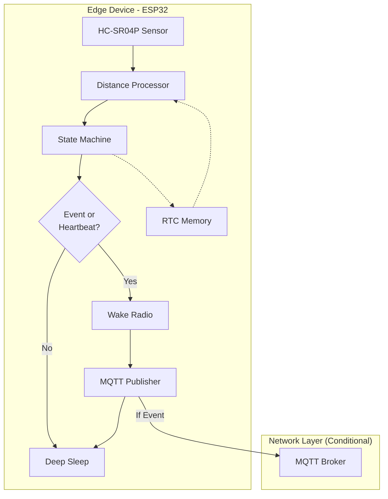

# IoT Mailbox Monitor

An ESP32-based smart mailbox system that detects mail delivery and collection using an HC-SR04P ultrasonic distance sensor. It features a power-efficient deep sleep architecture with RTC state persistence, ensuring long battery life while maintaining accurate mail tracking.


## Overview

The system monitors the distance from the top of a mailbox to the floor. When mail is delivered, the distance decreases, triggering a detection event. A state machine tracks mailbox status (empty, has mail, full, emptied) to prevent false duplicate events.

**Key Features:**

- **Deep Sleep Power Management:** ESP32 sleeps between measurements, waking periodically to conserve battery
- **RTC State Persistence:** Mailbox state, filter history, and virtual timing preserved across sleep cycles
- **Smart Wake Logic:** Radio only activates for critical events or periodic heartbeats
- **Fault Tolerance:** State machine survives power cycles and maintains accuracy
- **Smart Filtering:** Uses median filtering and refractory periods to ignore noise (insects, vibrations)
- **Ultrasonic Sensing:** HC-SR04P sensor provides reliable distance measurements with 3.3V compatibility

## Power Management Architecture

The system uses ESP32 deep sleep to achieve ultra-low power consumption:

### Wake-Up Strategy

```
    ┌─────────────┐
    │ Deep Sleep  │  (~10µA current draw)
    │   5 seconds │
    └──────┬──────┘
           │ Timer Wake
           ▼
    ┌─────────────┐
    │  Measure    │  Take single distance reading
    │  Distance   │  Process through state machine
    └──────┬──────┘
           │
           ▼
    ┌──────────────┐
    │ Event Check  │
    └──┬────────┬──┘
       │        │
  Critical   Periodic
   Event?    Update?
       │        │
       ├────────┤
       ▼        ▼
    ┌─────────────┐
    │ Wake Radio  │  Connect Wi-Fi & MQTT
    │ Publish     │  Send event/status
    │ Disconnect  │
    └──────┬──────┘
           ▼
    ┌─────────────┐
    │ Deep Sleep  │  Save state to RTC memory
    └─────────────┘
```

### Virtual Time Management

Since the ESP32 loses track of real time during deep sleep, the system maintains a **virtual clock** in RTC memory:

```cpp
// On each wake-up:
virtual_time_us += SLEEP_DURATION_US;  // Advance by sleep period
processor.Process(raw_distance, virtual_time_us);  // Use virtual time
```

This enables accurate state machine timing (hold periods, refractory periods) across sleep cycles.

### Radio Activation Logic

The Wi-Fi radio only powers on when:

1. **Critical Event Detected:**

   - New mail drop (`mail_detected = true`)
   - Mail collection (`mail_collected = true`)

2. **Periodic Heartbeat:**
   - Status update every hour (configurable via `HEARTBEAT_INTERVAL_SEC`)
   - Ensures system health visibility even when idle

Otherwise, the system remains in deep sleep, consuming minimal power.

## How It Works

1.  **Initialization:** On fresh boot, system initializes all state in RTC memory
2.  **Wake & Measure:** Timer wakes ESP32, ultrasonic sensor measures distance via GPIO
3.  **Processing:**
    - **Median filter** smooths readings (filter state preserved in RTC)
    - **State machine** determines if change is a valid event
4.  **Radio Decision:** Activate Wi-Fi only if event detected or heartbeat due
5.  **Telemetry:** If radio active, publish JSON events/status via MQTT
6.  **Sleep:** Save complete state to RTC memory, enter deep sleep for 5 seconds

## Hardware Requirements

- ESP32 development board (ESP32-WROOM-32 or similar)
- HC-SR04P ultrasonic distance sensor
- **Power source:** USB or battery (3.7V LiPo recommended for portable deployment)

### HC-SR04P Advantages

- **3.3V Compatible:** Works directly with ESP32 logic levels (unlike standard HC-SR04 which requires 5V)
- **Simple GPIO Interface:** Uses trigger/echo pulse timing method
- **No external components:** No level shifters or voltage dividers needed
- **Wide measurement range:** 2cm to 400cm effective range
- **Cost effective:** Inexpensive and widely available
- **Reliable:** Proven ultrasonic technology with minimal false readings

## IoT Value Stack



### Layer Responsibilities

| Layer                 | Purpose                                               | Outputs                                       |
| --------------------- | ----------------------------------------------------- | --------------------------------------------- |
| **HC-SR04P**          | Ultrasonic distance measurement via GPIO pulse timing | Distance in cm (or -1 on error)               |
| **DistanceProcessor** | Filtering, state tracking, detection, quality metrics | Structured `DistanceData` with state & events |
| **RTC Store**         | Persistent state across sleep cycles                  | State context, virtual time, boot count       |
| **Radio Controller**  | Conditional Wi-Fi/MQTT activation                     | Event publishing only when necessary          |
| **DistanceTelemetry** | JSON formatting and MQTT publishing                   | Event logs and periodic status updates        |
| **MQTTPublisher**     | Network communication                                 | Publishes JSON to MQTT broker topics          |

### Mailbox States

The processor maintains one of four states (persisted in RTC memory):

| State        | Description                      | Can Trigger            |
| ------------ | -------------------------------- | ---------------------- |
| **EMPTY**    | Mailbox is empty, ready for mail | `mail_drop` event      |
| **HAS_MAIL** | Mail detected and present        | `mail_collected` event |
| **FULL**     | Mailbox is full (multiple items) | `mail_collected` event |
| **EMPTIED**  | Just emptied (transitional)      | (none - brief state)   |

## Project Structure

```
├── config/
│   └── config.hpp                    # Global configuration constants
│
├── hardware/
│   └── ultrasonic/
│       ├── hcsr04.hpp                # HC-SR04P sensor interface
│       └── hcsr04.cpp                # HC-SR04P sensor implementation
│
├── processor/
│   ├── processor.hpp    # Distance processing & detection
│   └── processor.cpp    # Filtering, tracking, state machine
│
├── telemetry/
│   ├── telemetry.hpp    # Telemetry publishing interface
│   ├── telemetry.cpp    # JSON formatting & logging
│   │
│   └── publisher/
│       ├── publisher.hpp                  # MQTT client wrapper
│       └── publisher.cpp                  # MQTT connection & publishing
│
└── main.cpp                          # Application entry point & deep sleep control
```

## Software Architecture

The system follows a "Power First" priority. Sleep is the default state; wake events are minimal and purposeful.

```cpp
// Simplified logic of main.cpp
void app_main() {
    // 1. Restore state from RTC memory
    bool fresh_boot = (esp_sleep_get_wakeup_cause() != ESP_SLEEP_WAKEUP_TIMER);
    if (fresh_boot) {
        initialize_rtc_state();
    } else {
        virtual_time += SLEEP_DURATION;
        restore_processor_state();
    }

    // 2. Take measurement via GPIO pulse timing
    float dist = ultrasonic_sensor.MeasureDistance();
    DistanceData data = processor.process(dist, virtual_time);

    // 3. Evaluate wake conditions
    bool critical_event = data.mail_detected || data.mail_collected;
    bool heartbeat_due = (runtime_sec >= last_telemetry + HEARTBEAT_INTERVAL);

    // 4. Conditional radio activation
    if (critical_event || heartbeat_due) {
        connect_wifi_blocking();
        telemetry.publish(data);
        wifi_disconnect();
    }

    // 5. Save state and sleep
    save_to_rtc(processor.state);
    esp_deep_sleep(SLEEP_DURATION_US);
}
```

## Configuration

All system parameters are defined in `config/config.hpp`:

### Key Parameters

```cpp
// Hardware configuration
HCSR04_TRIGGER_PIN = GPIO_NUM_5     // Trigger pin (output)
HCSR04_ECHO_PIN = GPIO_NUM_18       // Echo pin (input)
TRIGGER_PULSE_uS = 10               // Trigger pulse duration (µs)
ECHO_TIMEOUT_US = 35000             // Echo timeout (µs)

// Detection sensitivity
BASELINE_CM = 40.0          // Empty mailbox distance
TRIGGER_DELTA_CM = 2.0      // Minimum change to detect
HOLD_MS = 200               // Must persist this long
REFRACTORY_MS = 8000        // Cooldown between events (ms)

// Signal processing
FILTER_WINDOW = 3           // Median filter size

// Power management
DEEP_SLEEP_US = 5000000        // Sleep duration between measurements (5s)
HEARTBEAT_INTERVAL_SEC = 3600  // Periodic status update interval (1 hour)

// MQTT Configuration
MQTT_BROKER_URI = "mqtt://192.168.1.100:1883"  // Your MQTT broker
MQTT_BASE_TOPIC = "home/mailbox"               // Base topic prefix
MQTT_CLIENT_ID = "mailbox-sensor-001"          // Unique client ID

// Wi-Fi Connection
CONN_SSID = "YourSSID"      // Wi-Fi network name
PASSWORD = "YourPassword"   // Wi-Fi password
```

### Derived Thresholds

The processor automatically calculates three thresholds from `BASELINE_CM` and `TRIGGER_DELTA_CM`:

```cpp
Empty threshold  = BASELINE_CM - (TRIGGER_DELTA_CM × 0.5)   // 39.0 cm
Trigger threshold = BASELINE_CM - TRIGGER_DELTA_CM          // 38.0 cm
Full threshold    = BASELINE_CM - (TRIGGER_DELTA_CM × 2)    // 36.0 cm
```

### Calibration

1. **Measure your mailbox**: Place sensor at top, measure distance to empty floor
2. **Set `BASELINE_CM`**: Update in `config.hpp` with your measurement
3. **Adjust sensitivity**: Tune `TRIGGER_DELTA_CM` based on typical mail thickness
   - **HC-SR04P recommendation**: Start with 2.0-3.0 cm for reliable detection
   - Increase if you get false positives from vibrations or insects
   - Typical accuracy is ±3mm, so avoid going below 2.0 cm
4. **Optimize filtering**: Ultrasonic sensors can be affected by ambient conditions
   - **Recommended**: Start with `FILTER_WINDOW = 3` for balance
   - Increase to 5 if experiencing noisy readings
   - Lower values = faster detection but more noise sensitivity
5. **Tune hold time**: Adjust `HOLD_MS` for responsiveness
   - **Recommended**: Start with 200 ms for reliable validation
   - Increase if detecting transient events (insects, vibrations)
6. **Configure power**: Adjust `DEEP_SLEEP_US` to balance responsiveness vs battery life
7. **Set heartbeat**: Configure `HEARTBEAT_INTERVAL_SEC` for periodic check-ins
8. **Configure MQTT**: Set broker URI and topics in `config.hpp`
9. **Test**: Monitor logs and fine-tune based on your specific mailbox characteristics

### Hardware Wiring

Connect the HC-SR04P to your ESP32:

| HC-SR04P Pin | ESP32 Pin | Connection Required | Notes                      |
| ------------ | --------- | ------------------- | -------------------------- |
| VCC          | 3.3V      | **YES**             | 3.3V compatible (HC-SR04P) |
| GND          | GND       | **YES**             | Common ground              |
| TRIG         | GPIO 5    | **YES**             | Trigger pin (configurable) |
| ECHO         | GPIO 18   | **YES**             | Echo pin (configurable)    |

**Important:** Make sure you have the **HC-SR04P** variant (3.3V compatible), not the standard HC-SR04 (5V only). The HC-SR04P can be powered by 3.3V and outputs 3.3V logic levels safe for ESP32.

#### HC-SR04 vs HC-SR04P

| Feature           | HC-SR04 (Standard)             | HC-SR04P (Plus)         |
| ----------------- | ------------------------------ | ----------------------- |
| Operating Voltage | 5V only                        | 3.3V - 5.5V             |
| Logic Levels      | 5V (needs level shifter)       | 3.3V (ESP32 compatible) |
| Current Draw      | ~15mA                          | ~15mA                   |
| Range             | 2cm - 400cm                    | 2cm - 400cm             |
| Use with ESP32    | Requires level shifter/divider | Direct connection       |

### Power Consumption Estimates

Typical current draw (ESP32-WROOM-32 + HC-SR04P):

| Mode               | Current | Duration        | Notes                             |
| ------------------ | ------- | --------------- | --------------------------------- |
| Deep Sleep         | ~10 µA  | 5 sec (default) | RTC + ULP active                  |
| Wake & Measure     | ~30 mA  | ~60 ms          | HC-SR04P + GPIO + processing      |
| Wi-Fi Active       | ~160 mA | ~3 sec          | Connect, publish, disconnect      |
| **Average (idle)** | ~12 µA  | -               | No events, heartbeat every 1 hour |
| **Average (busy)** | ~180 µA | -               | 5 events/hour + hourly heartbeat  |

**Battery Life Estimate (2000mAh LiPo):**

- Idle monitoring: ~6-7 months
- Active use (20 events/day): ~4-5 months

## MQTT Integration

### Topic Structure

The system publishes to three topic patterns under your configured base topic:

```
{base_topic}/events/mail_drop      - New mail detected events
{base_topic}/events/mail_collected - Mail collection events
{base_topic}/status                - Periodic status updates (hourly)
```

**Example with base topic `home/mailbox`:**

- `home/mailbox/events/mail_drop`
- `home/mailbox/events/mail_collected`
- `home/mailbox/status`

### Setup

```cpp
// In main.cpp after wake event
if (critical_event || periodic_update) {
    auto ipv4_addr = connect_wifi_blocking();

    Telemetry::Telemetry telemetry;
    telemetry.InitMQTT(
        MQTT_BROKER_URI,
        MQTT_BASE_TOPIC,
        MQTT_CLIENT_ID,
        nullptr,  // Username (optional)
        nullptr   // Password (optional)
    );

    telemetry.Publish(data, processor.GetBaseline(), processor.GetThreshold(), ipv4_addr);

    telemetry.Stop();
    esp_wifi_disconnect();
    esp_wifi_stop();
}
```

### Connection Features

- **Conditional connection**: Only connects when events occur or heartbeat is due
- **Auto-reconnect**: Handles connection failures gracefully
- **QoS 1**: At-least-once delivery guarantee for all messages
- **Power optimized**: Disconnects immediately after publishing

## Telemetry Output

### Periodic Status (every hour by default)

**Topic**: `{base_topic}/status`

```json
{
  "device_ip": "192.168.1.100",
  "timestamp": "26.11.2025 19:11:25",
  "distance_cm": 37.3,
  "baseline_cm": 40.0,
  "threshold_cm": 38.0,
  "success_rate": 0.98,
  "mailbox_state": "has_mail"
}
```

**Mailbox states**: `"empty"`, `"has_mail"`, `"full"`, `"emptied"`

### Mail Drop Event (when new mail detected)

**Topic**: `{base_topic}/events/mail_drop`

```json
{
  "device_ip": "192.168.1.100",
  "timestamp": "26.11.2025 19:11:25",
  "distance_cm": 37.2,
  "baseline_cm": 40.0,
  "duration_ms": 485,
  "confidence": 0.87,
  "success_rate": 0.98,
  "new_state": "has_mail"
}
```

**Triggered**: Only when transitioning from EMPTY → HAS_MAIL (radio wakes immediately)

### Mail Collection Event (when mailbox emptied)

**Topic**: `{base_topic}/events/mail_collected`

```json
{
  "device_ip": "192.168.1.100",
  "timestamp": "26.11.2025 19:11:25",
  "before_cm": 37.2,
  "after_cm": 39.8,
  "baseline_cm": 40.0,
  "duration_ms": 280,
  "success_rate": 0.97,
  "new_state": "emptied"
}
```

**Triggered**: When transitioning from HAS_MAIL or FULL → EMPTIED (radio wakes immediately)

## State Machine Behavior


**Key insight**: Once mail is detected, the system enters HAS_MAIL or FULL state and will NOT trigger another `mail_drop` event until the mailbox is emptied. This prevents false duplicate events from mail sitting in the box.

## RTC Memory Persistence

The following state is preserved across deep sleep cycles:

```cpp
struct RtcStore {
    uint32_t boot_count;                     // Number of wake-ups
    StateContext processor_state;             // Complete processor state:
        // - Median filter window & index
        // - Current mailbox state
        // - Occlusion tracking
        // - Success rate counters
        // - State transition timestamps
    uint64_t last_telemetry_time_sec;        // Last heartbeat timestamp
    uint64_t virtual_time_us;                // Virtual microsecond clock
};
```

This state survives:

- Deep sleep cycles
- Power brownouts (if powered)
- Does NOT survive complete power loss

## Example Event Sequence with Deep Sleep

```
Wake#  Time     Distance  State      Event           Radio    MQTT Topic
═══════════════════════════════════════════════════════════════════════════════════
0      0s       40.0 cm   EMPTY      Fresh boot      ON       {base}/status
       ...      Sleep for 5 seconds...
1      5s       40.0 cm   EMPTY      -               OFF      (no event)
       ...      Sleep for 5 seconds...
2      10s      40.0 cm   EMPTY      -               OFF      (no event)
       ...      Sleep for 5 seconds...
3      15s      37.2 cm   EMPTY      Mail dropping   OFF      (occlusion started)
       ...      Sleep for 5 seconds...
4      20s      37.1 cm   HAS_MAIL   mail_drop       ON       {base}/events/mail_drop
       ...      Publish event, disconnect, sleep...
5      25s      37.3 cm   HAS_MAIL   -               OFF      (mail sitting)
6      30s      37.2 cm   HAS_MAIL   -               OFF      (no event)
       ...      Many sleep cycles with mail present...
720    3600s    37.1 cm   HAS_MAIL   Heartbeat       ON       {base}/status
       ...      1 hour elapsed, publish status...
721    3605s    37.1 cm   HAS_MAIL   -               OFF      (mail still there)
       ...      Sleep cycles continue...
800    4000s    39.8 cm   HAS_MAIL   Mail rising     OFF      (collection started)
801    4005s    40.0 cm   EMPTIED    mail_collected  ON       {base}/events/mail_collected
       ...      Publish event, disconnect, sleep...
802    4010s    40.1 cm   EMPTY      -               OFF      (ready for new mail)
```

## Building and Flashing

```bash
# Configure Wi-Fi credentials
idf.py menuconfig
# Navigate to: Example Connection Configuration

# Build project
idf.py build

# Flash to ESP32
idf.py flash monitor
```

## Troubleshooting

### Deep Sleep Issues

- **Won't wake up**: Check timer configuration, verify `esp_deep_sleep_start()` is called
- **State loss**: Verify RTC_DATA_ATTR is used for persistent variables
- **Incorrect timing**: Check virtual time calculations, verify sleep duration matches config

### HC-SR04P Sensor Issues

- **No readings**: Verify you have HC-SR04P (3.3V), not standard HC-SR04 (5V only)
- **Distance always -1**: Check wiring (TRIG/ECHO connections), verify 3.3V power
- **Timeout errors**: Increase `ECHO_TIMEOUT_US` in config, check for physical obstructions
- **Erratic readings**:
  - Check for reflective or sound-absorbing surfaces in mailbox
  - Angle sensor slightly downward (5-10 degrees) for better reflection
  - Ensure sensor is mounted firmly to prevent vibration
- **False positives**: Increase `HOLD_MS` or `TRIGGER_DELTA_CM` to filter out transient events

### MQTT Connection Issues

- **Cannot connect**: Verify broker URI and port (typically 1883), check network connectivity
- **Connection drops**: Normal during sleep cycles; errors at disconnect are expected
- **Messages not publishing**: Verify event detection logic, check Wi-Fi connection before MQTT init
- **Transport errors on disconnect**: Expected behavior when WiFi disconnects while MQTT active

### Detection Issues

- **False positives**: Increase `HOLD_MS` or `TRIGGER_DELTA_CM`
- **Missed detections**: Decrease `TRIGGER_DELTA_CM`, verify `BASELINE_CM` calibration
- **Duplicate events**: Check state machine logic, verify refractory period
- **Delayed events**: Normal with deep sleep; event published on next wake cycle (max 5 sec delay)

### Power Consumption Higher Than Expected

- **Check sleep duration**: Verify `DEEP_SLEEP_US` is configured correctly
- **Monitor wake frequency**: Check if events triggering more often than expected
- **Verify radio shutdown**: Ensure `telemetry.Stop()` and `esp_wifi_stop()` are called after publishing
- **Sensor power**: HC-SR04P draws ~15mA during measurement burst
